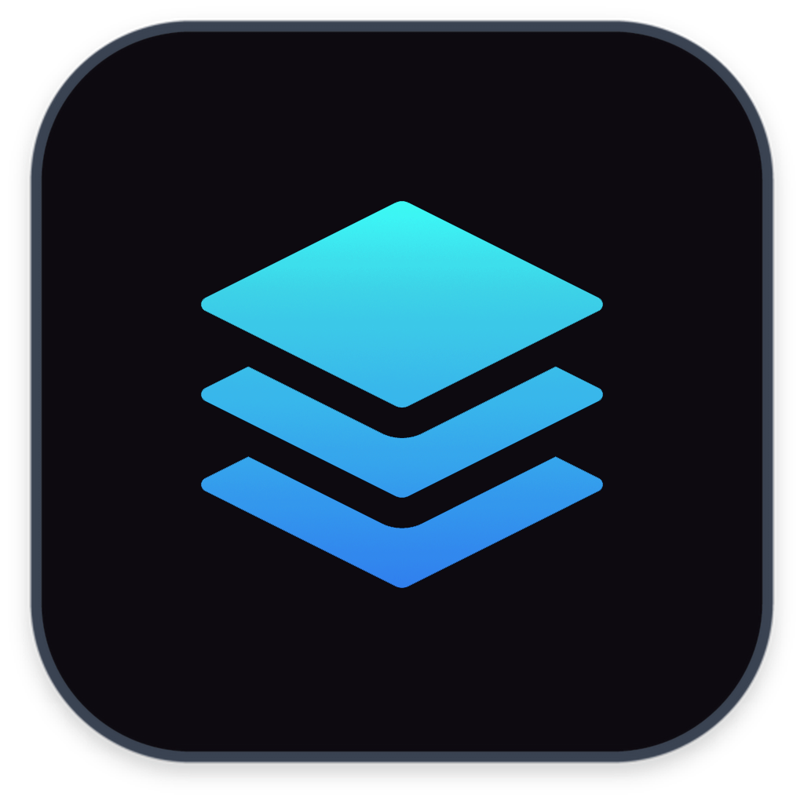
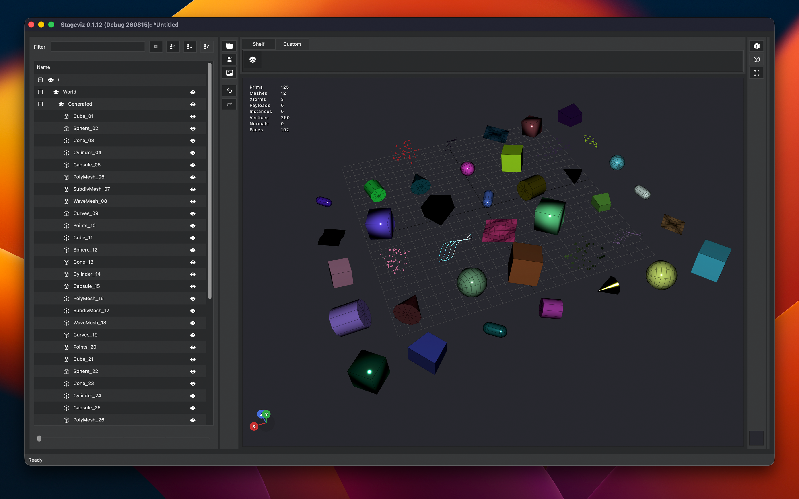

#  Stageviz: OpenUSD editor

[](https://github.com/mikaelsundell/stageviz/blob/master/README.md)

Table of Contents
=================

- [StageViz: OpenUSD Viewer & Editor](#stageviz-openusd-viewer--editor)
- [Table of Contents](#table-of-contents)
  - [Introduction](#introduction)
  - [Features](#features)
  - [Documentation](#documentation)
    - [Stage hierarchy](#stage-hierarchy)
    - [Property editor](#property-editor)
    - [Viewport](#viewport)
    - [Materials](#materials)
    - [Python scripting](#python-scripting)
  - [Building](#building)
  - [Web Resources](#web-resources)
  - [Copyright](#copyright)

Introduction
------------



Stageviz is a desktop application for viewing, inspecting and editing [OpenUSD](https://openusd.org/) stages.

Built around Pixar's OpenUSD and Hydra imaging frameworks, Stageviz provides an interactive environment for exploring USD scene hierarchies, inspecting and modifying properties, working with materials and visualizing stages using modern Hydra rendering.

The application is designed as a lightweight standalone tool for artists, developers and technical directors working with USD assets and pipelines.

Stageviz runs on macOS and Windows.

Features
--------

- **OpenUSD stage viewing** — Open and inspect USD, USDA, USDC and USDZ stages.
- **Hydra rendering** — Interactive viewport rendering using the OpenUSD Hydra imaging framework.
- **Stage hierarchy** — Browse the USD prim hierarchy and inspect scene structure.
- **Property editing** — Inspect and edit authored USD attributes and metadata.
- **USD composition** — Inspect composition-related information such as payloads, references and variants.
- **Material support** — View scenes using authored USD materials and shaders.
- **MaterialX** — Support for MaterialX-based shading workflows through USD/Hydra.
- **Display modes** — Control scene materials, lighting and viewport display settings.
- **Camera navigation** — Interactive camera navigation and framing of scene content.
- **Selection** — Select primitives directly from the hierarchy and viewport.
- **Python scripting** — Extend Stageviz and manipulate the current USD stage using Python.
- **Python shelf** — Store and execute reusable Python tools directly inside Stageviz.
- **Drag and drop** — Open or import USD assets using drag-and-drop workflows.
- **Cross-platform** — Built for macOS and Windows.

Documentation
-------------

### Stage hierarchy

The stage hierarchy displays the composed prim hierarchy of the currently opened USD stage.

It can be used to navigate the scene and select primitives for inspection or editing.

USD stages may contain many different prim types, including:

```text
Xform
Scope
Mesh
BasisCurves
Points
Camera
Light
Material
Shader
```

Selecting a prim updates the property editor and other parts of the interface associated with the current selection.

The hierarchy represents the composed USD stage rather than simply displaying the contents of an individual USD layer.

### Property editor

The property editor provides access to properties and metadata associated with the selected USD prim.

Properties are presented using controls appropriate for their underlying USD value types.

Common values can be edited using specialized controls such as:

- Check boxes for boolean values.
- Drop-down controls for token values with known options.
- Numeric editors for integer and floating-point values.
- Vector and color editors.
- Text editors for strings and tokens.
- Asset path controls.

Read-only or non-editable values are visually distinguished from editable authored properties.

The property editor can also expose information related to the selected prim, including its type and USD composition data.

Depending on the prim, this may include:

```text
Prim type
Payloads
References
Variant sets
Metadata
Attributes
Relationships
```

Edits are authored back into the appropriate editable USD layer.

### Viewport

The Stageviz viewport uses OpenUSD's Hydra imaging architecture to render the current stage.

The viewport provides interactive navigation and selection together with controls for how the stage is displayed.

Display options include control over:

```text
Scene materials
Scene lights
Default camera light
Background color
Grid
Material/display mode
```

Stageviz uses Hydra scene-index based functionality where appropriate, allowing viewport behavior to be implemented without modifying the underlying USD stage.

### Materials

Stageviz supports materials authored using USD's material and shader schemas.

When scene materials are enabled, authored materials are passed through the Hydra rendering pipeline.

Material workflows can include USDShade and MaterialX networks depending on the renderer and OpenUSD configuration being used.

Stageviz also provides scripting capabilities that make it possible to create or modify materials directly on the current stage.

This can be used for tools such as:

```text
Material creation
Material assignment
Material overrides
Procedural looks
Car paint
Wood-like materials
Diagnostic materials
```

### Python scripting

Stageviz embeds Python to allow tools and scripts to interact with the application and the currently loaded USD stage.

Python scripts can use the OpenUSD Python API to inspect or modify scene data.

For example, a script can create geometry on the current stage:

```python
from pxr import Gf, UsdGeom

stage = stageviz.stage()

cube = UsdGeom.Cube.Define(stage, "/Cube")
cube.CreateSizeAttr(2.0)

cube.CreateDisplayColorAttr([
    Gf.Vec3f(1.0, 0.4, 0.0)
])
```

> The exact Stageviz Python API available to scripts depends on the application's current scripting interface.

Python tools can be stored on the Stageviz shelf, allowing commonly used scripts to behave like integrated application tools.

This makes it possible to build lightweight pipeline tools without recompiling Stageviz.

Typical scripts can perform operations such as:

```text
Create geometry
Modify attributes
Assign materials
Generate procedural materials
Inspect USD data
Validate scene content
Modify selections
Create pipeline-specific tools
```

Building
--------

StageViz is written in C++ using Qt and OpenUSD.

The application requires a compatible build of its third-party dependencies.

### macOS

Set the third-party dependency directory:

```shell
export THIRDPARTY_DIR=<path>
```

Build a debug version:

```shell
./build_app.sh debug
```

Build a release version:

```shell
./build_app.sh release
```

When using debug versions of frameworks on macOS, make sure `DYLD_IMAGE_SUFFIX` is configured appropriately:

```shell
export DYLD_IMAGE_SUFFIX=_debug
```

### Windows

Make sure the appropriate Visual Studio development environment is configured before building.

For example:

```shell
"C:\Program Files\Microsoft Visual Studio\2022\Professional\VC\Auxiliary\Build\vcvarsall.bat" x86_amd64
```

Set the third-party dependency directory:

```shell
set THIRDPARTY_DIR=<path>
```

Build a debug version:

```shell
call build_app.bat Debug --deploy
```

Build a release version:

```shell
call build_app.bat Release --deploy
```

Dependencies
------------

StageViz is built using a number of open-source technologies, including:

- [OpenUSD](https://openusd.org/)
- [Qt](https://www.qt.io/)
- [MaterialX](https://materialx.org/)
- [oneTBB](https://github.com/uxlfoundation/oneTBB)

Additional dependencies may be provided through the StageViz third-party build environment.

Web Resources
-------------

* GitHub page: https://github.com/mikaelsundell/stageviz
* Issues: https://github.com/mikaelsundell/stageviz/issues
* OpenUSD: https://openusd.org/
* OpenUSD documentation: https://openusd.org/release/index.html
* MaterialX: https://materialx.org/

Copyright
---------

Copyright (c) 2025 - present Mikael Sundell.

StageViz is distributed under the BSD 3-Clause License.

**Third-party libraries acknowledgment and copyright notice**

This product includes software developed by third parties. The copyrights and terms of use of these third-party libraries are fully acknowledged and respected.

StageViz uses software including OpenUSD, Qt, MaterialX, oneTBB and their respective dependencies.

The use of third-party software within this product is subject to the licenses and terms of the respective copyright holders. The inclusion of these libraries does not imply endorsement of StageViz by their respective authors or organizations.